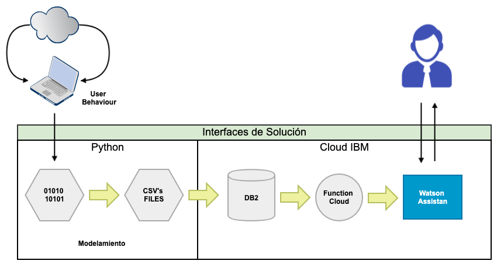

<b>IAA (Inteligencia Artificial Aplicada):</b>

El repositorio contiene el trabajo realizado para IAA (Inteligencia Artificial Aplicada), el cual tiene como objetivo, construir una agente virtual para el proceso de recomendacion de peliculas.

El agente se construyo utilizando <a href="https://cloud.ibm.com/docs/services/assistant?topic=assistant-getting-started#getting-started">Watson Assistan</a> y el modelo de recomendación siguiendo el paper: <a href="http://yifanhu.net/PUB/cf.pdf">Collaborative Filtering for Implicit Feedback Datasets</a>, de Yifan Hu, Yehuda Koren y Chris Volinsky. Para ello, se utilizará la API en Python <a href="https://github.com/benfred/implicit">"Implicit"</a>, desarrollada por <a href="https://implicit.readthedocs.io/en/latest/">Ben Frederickson</a>(© Copyright 2017).

<b>El diagrama de solucion es:</b>

